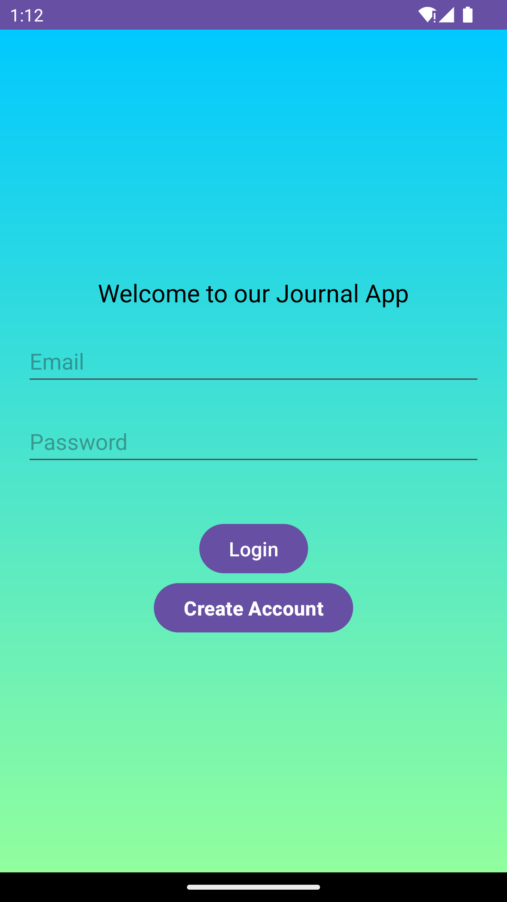
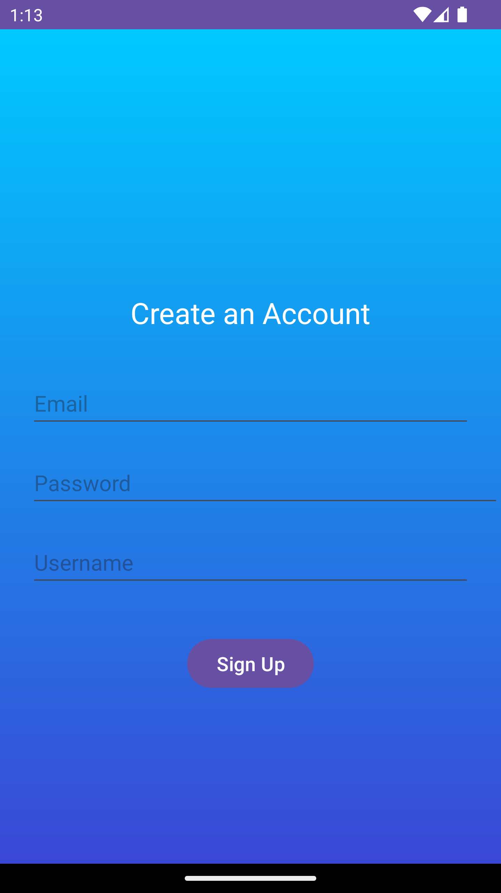
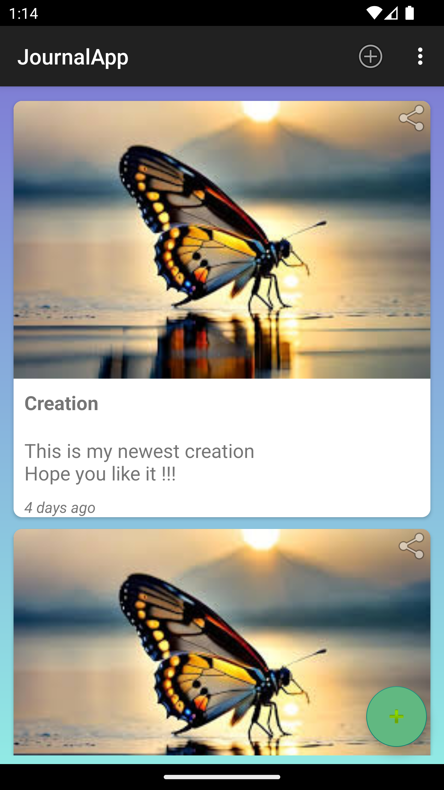
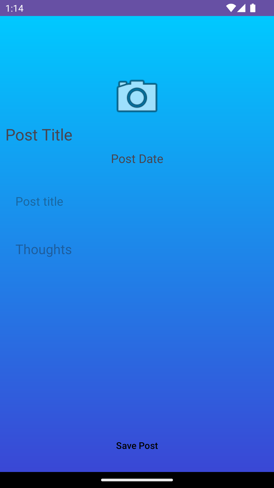

# Journal App

This is an android application built in kotlin to create and store journals. In this the user can add an image , add title and write the description or their thoughts. The user can also share these journals. It has a secure way of creating account , which is handled by firebase authentication and all journals are stored using firestore storage.

# Technology used

1. Android Studio
2. Kotlin
3. Firebase Auth
4. Firestore storage

# Install the project

```git
git clone https://github.com/Sachdevabhavya/JournalApp.git
```

# Dependencies required

Add the following dependencies to run the app in the following file given :

- build.gradle.kts(module):

```kt
implementation(platform("com.google.firebase:firebase-bom:33.1.1"))
    implementation("com.google.firebase:firebase-analytics")

    //FireStore
    implementation("com.google.firebase:firebase-firestore")

    //Authentication
    implementation("com.google.firebase:firebase-auth")

    //Storage
    implementation("com.google.firebase:firebase-storage")

    //Glide
    implementation ("com.github.bumptech.glide:glide:4.16.0")
    annotationProcessor ("com.github.bumptech.glide:compiler:4.14.2")
```

# Update SDK in Build.gradle

```kt
compile Sdk = 34
target Sdk = 34
```

# plugins required

Add the following plugins to run the app in their respective file given :

- build.gradle.kts(module)

```kt
id("kotlin-kapt")
```

- This app is made using firebase authentication and firebase storage , so generate a .json file using firebase console and store that file in the app folder.

# Set dataBindable

In Build.gradle file add the following code in android :

```kt
buildFeatures{
    dataBinding = true
}

```

# Features

<p align="center">
  
  
  
  
</p>

1. User can create account and login , handled by firebaseAuth :
   <br>
   

2. User can see posts created in a list format:
   <br>
   

3. User can create a post :
   <br>
   
   
4. User also have an option to share the post.

# Android Verion

This app is made for android 7 and above versions
